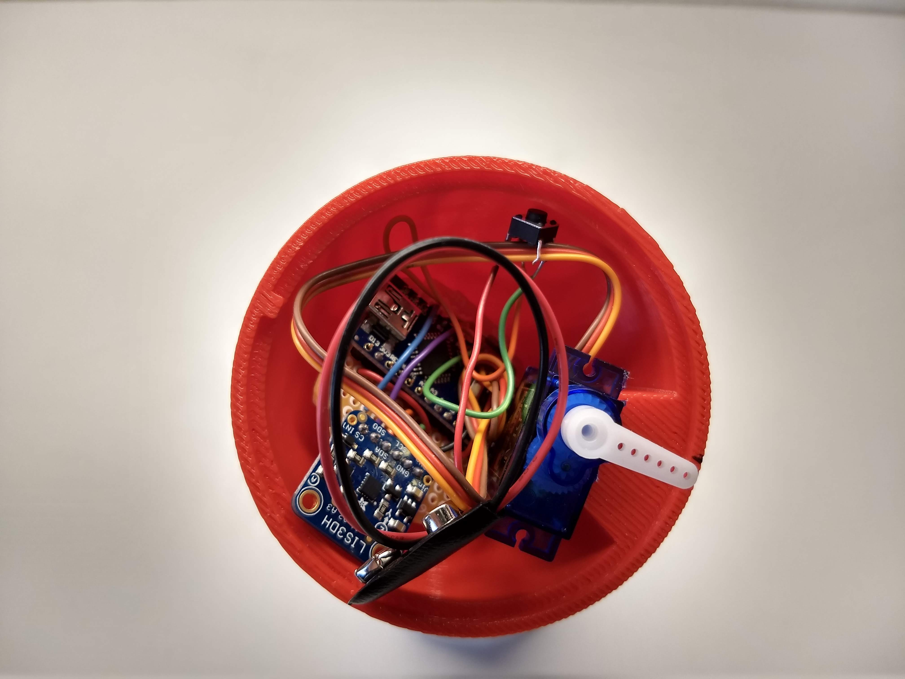
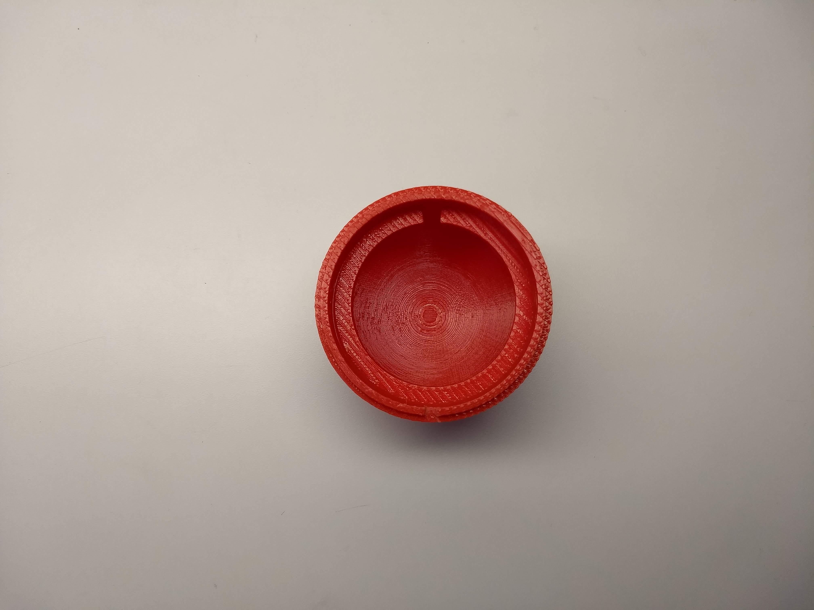
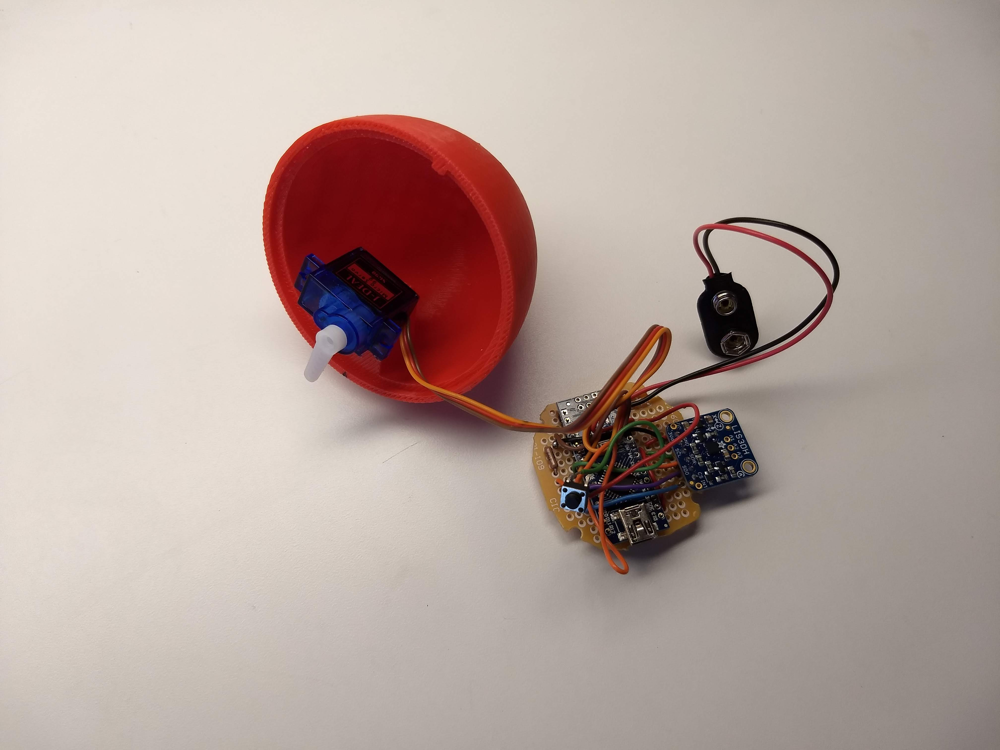
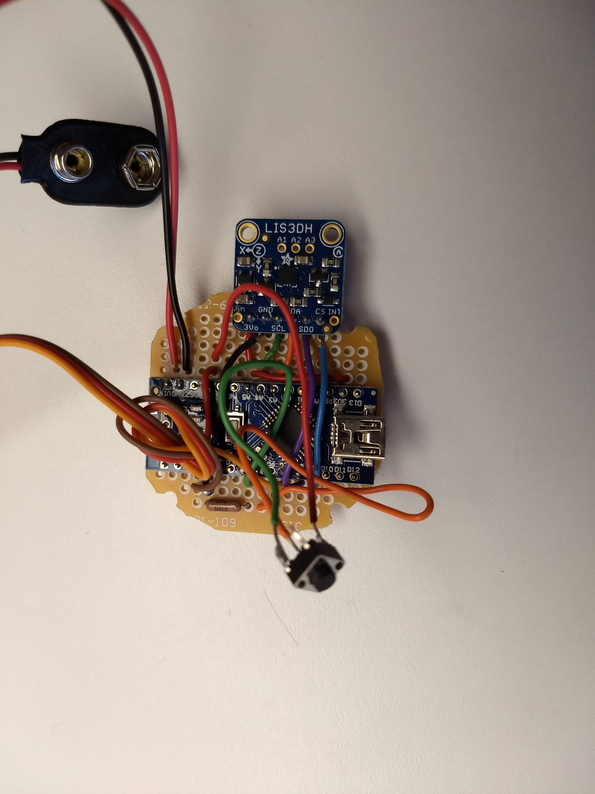

# Patience-Egg
An egg that only unlocks if the user is patient and waits for the egg to unlock itself.

# How It Works
The Arduino Nano takes readings from the LIS3DH accelerometer. If the egg has not been moved for the specified amount of time, the arduino triggers the servo to move, allowing the top of the egg to be removed. 

# Pictures

